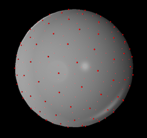
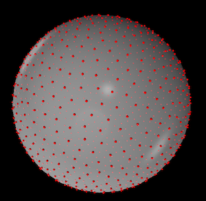
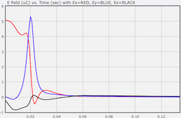
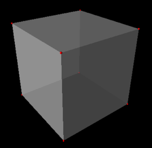
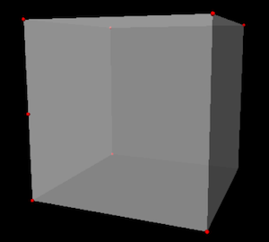
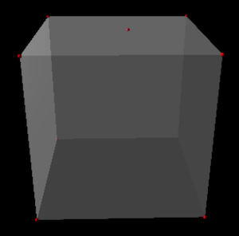
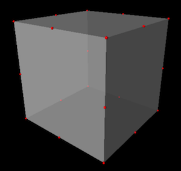
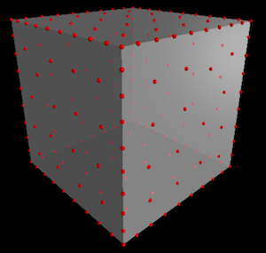
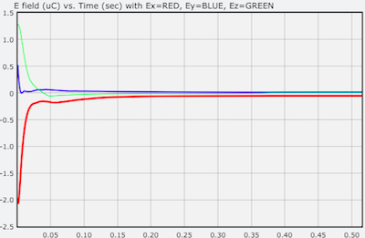

# Charges in a conductor and Gauss's Law

Developed by Larry Engelhardt

In this activity, students simulate and visualize the motion of excess charges in a conductor (both a sphere and a cube) in three-dimensional space, without any external electric field.  Students also compute the electric field from the conductor and discuss the results in the following three regimes: (1) Far from the conductor, (2) Close to the conductor, and (3) Inside the conductor. 

Note: Student-facing documents that have been used with students in a lab setting are provided under the "Code" tab as "Additional Resources".

	
Course Context
: First Year and  Beyond the First Year Electricity & Magnetism
	
	
Learning Objectives
: Students will be able to:

- Calculate the number of electrons for a total charge (**Exercise 1**)
- Observe and describe both the *approach* to equilibrium (the "transient" dynamics) and the final arrangement for charges in a conductor [**Exercises 2 (sphere); and 7, 8, and 9 (cube)**] 
- Write a computer function that will compute the net electric field from a system of system of charged particles (**Exercise 3**)
- Validate their numerical E-field results [**Exercises 4 (sphere) and 10 (cube)**]
- Test Gauss' Law numerically, and describe the results in the vicinity of a conductor [**Exercises 5 (close to a sphere), 6 (inside a sphere), 11 (close to a cube), and 12 (inside a cube)**]
	


## Instructor's Guide
**Overview:**

A huge part of this activity is ***seeing*** the charges repel from one another, end up on the surface of the conductor, and finally reach equilibrium.  Upon seeing this for the first time, the students said an audible, "whoa".  After the "whoa" students then also do some ***coding*** and use their code to do some ***analysis*** and ***interpretation***.

**Context:**

I have used this Exercise Set in my introductory calculus-based E&M course as part of a 3-hour lab activity.  During this 3-hour lab, I have started with a brief lecture in which we talk about both (1) unit vectors (specifically the meaning of the $\hat{r}$ vector), which is needed in order to calculate both $\vec{E}$ and $\vec{F}$; and (2) the lines of code that they will be given.  The students typically spent about 2.5 hours working on this (in pairs), and they were given a quiz at the end of the lab time.

**Prerequisites:**

Before doing this activity, the students had already been exposed to:

1. Coulomb's Law
2. Gauss's Law
3. Any excess charge will reside on the surface of a conductor

Coulomb's Law is certainly a prerequisite for this activity; it is used throughout. I would also consider Gauss's Law to be a prerequisite, since it provides both (A) a nice grounds for comparison of numerical data and (B) allows the opportunity to *refine* a students understanding of Gauss's Law; namely, Gauss's Law is not very useful outside of a cube, since it lacks the symmetry that would be necessary in order for us to calculate $E$ from Gauss's Law. Item 3 (that any excess charge will reside on the surface of a conductor) wouldn't need to be introduced before this activity.  It could be "discovered" as a part of this "computational experiment".  I am not sure which order would work better here, but I plan to try it the other way next time (allowing it to be discovered during the activity).


**Results:**

The numerical results from this simulation offer the following insights that are typically not appreciated when using strictly analytical methods:

1. When we are relatively far from a charge distribution, that charge distribution ***always*** looks like a point charge at the center of the distribution, even if the charge distribution is spread out on the surface of a cube.
2. We are able to observe "experimentally" that the electric field does indeed go to zero inside of a conductor.  Note that with a finite number of charges, $E$ is not *exactly* zero, but it is orders of magnitude smaller than the value of $E$ outside of the conductor.
3. We can verify that Gauss's Law does in fact "work" for a spherical conductor; namely that the sphere "looks like" a point charge at the origin when we are outside of the sphere.
4. We can experience the *limitations* of Gauss's Law. Namely, Gauss's Law is not very useful outside of the cube, since it lacks the symmetry of the sphere.  So the cube does **not** look like a point charge at the origin (unless you are very far away from the cube).

For introductory E&M, I only ask the students to compute $E$ at specific locations, but for upper-level E&M, it would be very appropriate to ask the students to write a *loop* in order to compute the value of $E$ for many values of $r$ (the distance from the origin) and to plot the results.

**Tips:**

Be aware that the electric field will not *perfectly* cancel inside of the simulated conductor since a finite number of charges are being used. In Exercise 6, the students are asked to use a value of $r$ that is located reasonably far inside of the conductor, which will provide good cancellation, such that the net electric field will be quite close to zero. If the students experiment with different positions within the conductor, they are likely to see that the electric field is not zero as they get close to the surface. The reason is that they are able to "see" the discrete nature of the charges when they get close to the surface, whereas far from the surface the charges appear continuous.

This code will run and display quite quickly using glowscript, especially in the Chrome web browser.  If you are familiar with Jupyter Notebooks, you can also run this code in Jupyter.  However, it will run much slower in Jupyter. 

**Algorithm:**

(See [http://www.compadre.org/PICUP/resources/Numerical-Integration/](http://www.compadre.org/PICUP/resources/Numerical-Integration/) for additional details about algorithms for computing dynamics.)

For the charges in a *spherical* conductor, the algorithm that is used doesn't particularly matter; the Euler of Euler-Cromer algorithm work fine.  In the rectangular (or cubic) conductor, there is an interesting "twist". Before describing the twist, I should note that **I HAVE NEVER POINTED THE FOLLOWING ISSUE OUT TO THE STUDENTS, AND THEY HAVE NEVER NOTICED OR ASKED ABOUT THIS**.

Here is the twist:

When two or more charges end up together on the edge of the cube, a first order algorithm (Euler or Euler-Cromer) is not stable and will quickly "blow up". One could instead use a higher-order algorithm (velocity Verlet of Runge-Kutta), but I didn't want to add extra code that would distract students from what they were doing.  So instead, I treated the charges in the "large friction limit,' where the force is **not** used to update the velocity according to Newton's 2nd Law,
$$\frac{\Delta \vec{v}}{\Delta t} = \frac{\vec{F}_{net}}{m}.$$
Instead, I used the net force to update the ***positions***,
$$\frac{\Delta \vec{r}}{\Delta t} = \frac{\vec{F}_{net}}{m}.$$
Clearly, this is not physically "true," so the *dynamics* that are calculated using this method will not be numerically accurate.  However, this model does give the correct qualitative behavior -- that the charges spread out -- and it also gives the correct final distribution of charges -- which minimizes the potential energy of the system and gives the correct value of the electric field.

For a more advanced audience, this issue of instability could be very appropriate to address and analyze in detail, for example in a course in computational physics, or numerical analysis, or advanced E&M.  Students could be asked to try different algorithms, analyze the stability, and verify that the "cheating" algorithm that is used here does indeed give the correct equilibrium distribution -- even though the transient dynamics are not accurate.

## Theory
The theory is simply Coulomb's Law!  In this activity though, the emphasis is placed on the ***summation*** in Coulomb's Law and the ***vector*** nature of Coulomb's Law. From Coulomb's Law, the electric field due to a collection of point charges is
$$\vec{E}_{net} = \sum_i \vec{E}_i,$$
where $\vec{E}_i$ is the electric field at some point, $\vec{P}$, due to the $i^{th}$ charge. If we let $\vec{r}_i$ represent the position of the $i^{th}$ charge, then the vector that points from the charge to the point $\vec{P}$ is
$$\vec{r} = \vec{P} - \vec{r}_i,$$
and the electric field at this point due to this (one) charge is
$$\vec{E}_i = \frac{K q}{r^2}\hat{r},$$
where 
$$\hat{r} = \frac{\vec{r}}{r},$$
is the unit vector that points in the direction from the charge to the point of interest, and 
$r = |\vec{r}|$ is the distance away from the charge.

If using glowscript, all of this is implemented on the following lines of code:
```
        r_vector = P - charge.pos # vector between charge & point P
        r = mag(r_vector)         # "r" is the magnitude of the r vector
        E = 1e-6 * K*q/r**2 * (r_vector/r) # The E field from this ONE charge
        E_net = E_net + E         # Computes the running sum, E_net
```

Using a traditional programming language, you might need to separately compute the vector components for each of the three (y, y, z) spatial components.


## Pseudocode
**General pseudocode for the entire program:**

Define variables: N, Q, m, R, dt, K

Of the variables above, the only two that the students were specifically asked to vary was the number of charges "N" and the radius of the conductor "R" (or "L" for the cube).

Create an array of charges, with random initial positions.

*LOOP* through time, and for each time step:

- Compute the net force on each charge.  (This requires a nested loop: For each charge, we must loop through all other charges.)  For the spherical conductor, we update the velocity of the charges here; for the cube, we update the positions of the charges here.  (See the "Instructor's Guide" for additional details about this.) 
- Loop through all charges, and for each charge:
    - Update the position.
    - Check whether of not the charge is outside the conductor.
    - If the charge **IS** outside the conductor, bring it back to the edge.
- Compute the electric field (to be completed by the student)

**To compute the electric field (Exercise 3):**

Get the value of "N" (the number of charges)

Initialize E_net to have an initial value of vec(0, 0, 0)

**LOOP** through all charges. (No need for a nested loop.)

- For each charge, compute the r-vector (P-vector minus charge position)
- Compute the magnitude of the r-vector, in order to compute the r-hat vector: r-hat = r-vector / r
- Compute E, the E-field for the one charge (the current iteration of the loop)
- Sum up the NET electric field by adding E onto E_net

After the loop is complete, return E_net


## Code Templates

 * code/C/CodeTemplate/Inline1.txt provided by Kelly Roos
 * code/C/CodeTemplate/Inline2.txt provided by Kelly Roos
 * code/EJS/CodeTemplate/Inline3.txt provided by Larry Engelhardt
 * code/EJS/CodeTemplate/Inline4.txt provided by Larry Engelhardt
 * code/Fortran/CodeTemplate/Inline5.txt provided by Kelly Roos
 * code/Fortran/CodeTemplate/Inline6.txt provided by Kelly Roos
 * code/Glowscript/CodeTemplate/Inline7.txt provided by Larry Engelhardt
 * code/Glowscript/CodeTemplate/Inline8.txt provided by Larry Engelhardt
 * code/IPython/CodeTemplate/Inline9.txt provided by Larry Engelhardt
 * code/IPython/CodeTemplate/Inline10.txt provided by Larry Engelhardt
 * code/IPython/CodeTemplate/Inline11.txt provided by Larry Engelhardt
 * code/IPython/CodeTemplate/Inline12.txt provided by Larry Engelhardt
 * code/Mathematica/CodeTemplate/Inline13.txt provided by Kelly Roos
 * code/Mathematica/CodeTemplate/Inline14.txt provided by Kelly Roos
 * code/Mathematica/CodeTemplate/Inline15.txt provided by Kelly Roos
 * code/Mathematica/CodeTemplate/Inline16.txt provided by Kelly Roos
 * code/MATLAB/CodeTemplate/Inline17.txt provided by Kelly Roos
 * code/MATLAB/CodeTemplate/Inline18.txt provided by Kelly Roos

## Completed Code

 * code/C/CompletedCode/Inline1.txt provided by Kelly Roos
 * code/C/CompletedCode/Inline2.txt provided by Kelly Roos
 * code/EJS/CompletedCode/Inline3.txt provided by Larry Engelhardt
 * code/EJS/CompletedCode/Inline4.txt provided by Larry Engelhardt
 * code/Fortran/CompletedCode/Inline5.txt provided by Kelly Roos
 * code/Fortran/CompletedCode/Inline6.txt provided by Kelly Roos
 * code/Glowscript/CompletedCode/Inline7.txt provided by Larry Engelhardt
 * code/Glowscript/CompletedCode/Inline8.txt provided by Larry Engelhardt
 * code/IPython/CompletedCode/Inline9.txt provided by Larry Engelhardt
 * code/IPython/CompletedCode/Inline10.txt provided by Larry Engelhardt
 * code/IPython/CompletedCode/Inline11.txt provided by Larry Engelhardt
 * code/IPython/CompletedCode/Inline12.txt provided by Larry Engelhardt
 * code/Mathematica/CompletedCode/Inline13.txt provided by Kelly Roos
 * code/Mathematica/CompletedCode/Inline14.txt provided by Kelly Roos
 * code/Mathematica/CompletedCode/Inline15.txt provided by Kelly Roos
 * code/Mathematica/CompletedCode/Inline16.txt provided by Kelly Roos
 * code/MATLAB/CompletedCode/Inline17.txt provided by Kelly Roos
 * code/MATLAB/CompletedCode/Inline18.txt provided by Kelly Roos

## Solutions
**Exercise 1:**

To calculate the number of excess electrons, we just take the ratio between the total charge and the charge of a single electron, giving
$$\frac{5\times 10^{-6}\textrm{ C}}{1.602\times 10^{-19}\textrm{ C}}=3.121\times 10^{13}\textrm{ excess electrons}.$$

This is a typical textbook homework problem, but it shows us that each simulated particle actually represents ***many*** electrons.

**Exercise 2:**

The charges repel from one another and spread out until all of the (excess) charge is on the surface of the conductor.  After reaching the surface, the charges continue to move apart from one another until they have become uniformly distributed on the surface, as shown in the figure below.  If we look closely though, we can also see dislocations and grain boundaries on the surface, which occur randomly -- as a result of the random initial positions.



**Fig. 1**: $N = 200$ excess charges in a spherical conductor.

The following figure shows an example using $N = 1000$ excess charges.



**Fig. 2**: $N = 1000$ excess charges in a spherical conductor.

**Exercise 3:**

Here is an example showing what the completed code for computing the electric field at a point $\vec{P}$ would like like if using glowscript:

```
def computeEfield(P):
    ''' The COMPLETED function to compute the total electric field at point P, which is a 3D vector. '''
    
    global charges
    N = len(charges)
    
    # E_net will be computed from a summation, so it is first set to zero
    E_net = vec(0,0,0)
    
    # Loop through all charges in order to compute the net E field
    for charge in charges:
        r_vector = P - charge.pos # vector between charge & point P
        r = mag(r_vector)         # "r" is the magnitude of the r vector
        E = 1e-6 * K*q/r**2 * (r_vector/r) # The E field from this ONE charge
        E_net = E_net + E         # Computes the running sum, E_net
    return E_net # This sends the computed value back to the main loop
```

The most important feature of this code is that instead of the ***nested*** loop, which was in the function to compute the forces, this only includes a ***single*** loop.

Note that depending on the programming language that is used to implement this, it might be necessary to separately compute the vector components for each (x, y, z) direction. (In glowscript, subtracting two vectors results in the vector difference; and multiplying scalars by a vector results in the appropriate new vector.)

Also note that in the example code (on the third from the last line), multiplying by `1e-6` converts the electric field from units of N/C to N/$\mu$C.

**Exercise 4:**
 
From Coulomb's Law, the electric field at a distance of $r = 0.5$ m away from a $q=6$ $\mu$C charge is
$$E = \frac{kq}{r^2} = \frac{(8.99\times 10^9\textrm{ Nm$^2$/C$^2$})(5\times 10^{-6}\textrm{ C})}{(0.5\textrm{ m})^2}$$
which gives the result $E = 1.798 \times 10^5$ N/C, or $E = 0.1798$ N/$\mu$C.  (The sign of $q$ is not relevant to the magnitude, $E$.)

Running the simulation for a spherical conductor of radius $R = 0.1$ m, I get the same number $E = 0.1798$ N/$\mu$C for the x-component of $\vec{E}$.  This is good!  (This was using a total of $N=200$ charges with total excess charge $q=6$ $\mu$C.)

For the y and z components, the value is smaller by a factor of more than 10,000, and as the simulation continues to run, these other components are slowly converging toward zero.

**Exercise 5:**

From Coulomb's Law, the electric field at a distance of $r = 0.15$ m away from a $q=6$ $\mu$C charge is
$$E = \frac{kq}{r^2} = \frac{(8.99\times 10^9\textrm{ Nm$^2$/C$^2$})(5\times 10^{-6}\textrm{ C})}{(0.15\textrm{ m})^2}$$
which gives the result $E = 1.998 \times 10^6$ N/C, or $E = 1.998$ N/$\mu$C.

Running the simulation, I get $E = 1.995$ N/$\mu$C for the x-component of $\vec{E}$, so the numbers differ by about 1.5%.  From Gauss's Law, the two numbers should be the same.  This slight difference is due to the finite number of charges.  When we get close to the surface, the $E$-field will be somewhat irregular -- being influenced by the precise positions of the individual charges, which results from the charges' random initial positions.

**Exercise 6:**

When ***inside*** of the conductor, the $E$-field starts out large and fluctuates greatly for the first several time steps -- because there is excess charge that is passing by the point of observation -- but once the charges get onto the surface and approach equilibrium, the $E$ field decays away to a small value.  It didn't take long to reach $E \approx 10^{-3}$ N/$\mu$C, which is a thousand times smaller than the $E$-field that was observed outside of the conductor.  The dynamics of this equilibriation is shown in the plot below. Due to the finite number of charges, the $E$-field won't be exactly zero, but it will be much smaller than the values that were observed outside of the conductor.



**Fig. 3**: Plot of each of the three components of $\vec{E}$ versus time for $R=0.1$ m and $r=0.05$ m. Within $t=0.1$ seconds, the electric field has become essentially zero.

**Exercise 7:**

The following figure shows the resulting configuration of $N=8$ excess charges in a conducting cube.



**Fig. 4**: $N = 8$ excess charges in a cubical conductor.  The 8 charges have ended up on the 8 corners of the cube.

The 8 charges push apart from one another and end up on the 8 corners of the cube.  This makes sense, because the charges go to the corners in order to get as far away from each other as possible.  (This minimizes the energy of the system.)  However, due to the random initial positions of the charges, sometimes a charge gets "stuck" in the middle of an edge, or in the middle of a surface, as shown below.



**Fig. 5**: $N = 8$ excess charges in a cubical conductor.  One of the 8 charges got stuck on the left edge, leaving one corner without a charge (bottom-right-back).



**Fig. 6**: $N = 8$ excess charges in a cubical conductor.  One of the 8 charges got stuck on the top surface, leaving one corner without a charge (bottom-right-back).

**Exercise 8:**

The following figure shows the resulting configuration of $N=20$ excess charges in a conducting cube.



**Fig. 7**: $N = 20$ excess charges in a cubical conductor.  The charges end up on each corner (8 charges) and in the middle of each edge (12 charges).  This is the configuration that minimizes the energy of the system.

With $N=20$ charges, it is common to end up with two charges that are "stuck" along an edge together, leaving another edge without a charge.


**Fig. 8**: $N = 20$ excess charges in a cubical conductor.  Two charges are stuck along one edge (back right) leaving another edge with no charges (back left).

**Exercise 9:**



**Fig. 9**: $N = 200$ excess charges in a cubical conductor.  With $N = 200$ charges we can clearly see that the charges are closer to one another along the edges, and they are farther apart from one another on the surfaces.

**Exercise 10:**

This is the same as Exercise 4, but with a cube instead of a sphere.  The $E$-field from a point charge is  $E = 0.1798$ N/$\mu$C. (See the solution for Exercise 4.)  Running the simulation for a cubical conductor of edge length $L = 0.1$ m, I get the almost exactly the same number $E = 0.17973$ N/$\mu$C for the x-component of $\vec{E}$.  (This was using a total of $N=200$ charges with total excess charge $q=6$ $\mu$C.)  So when we are far from the cube, the cube looks like a point charge!

For the y and z components, the value is smaller by a factor of more than 10,000, and as the simulation continues to run, these other components are slowly converging toward zero.

**Exercise 11:**

At a distance of $r=0.1$ m from a charge of $q = 6$ $\mu$C, the electric field would be
$$E = \frac{kq}{r^2} = \frac{(8.99\times 10^9\textrm{ Nm$^2$/C$^2$})(5\times 10^{-6}\textrm{ C})}{(0.1\textrm{ m})^2}$$
which gives the result $E = 4.495$ N/$\mu$C.

I executed the simulation to compute the electric field at a distance of $x  = 0.1$ m from the center of a cube of edge length $L=0.1$ m.  From the simulation, $E = 3.611$ N/$\mu$C.  This value is quite a bit less than $E = 4.495$ N/$\mu$C!  (The other components were smaller by a factor of 1000 or more.)

For a *sphere*, the electric field outside of the conductor was the same as the electric field due to a point charge at the origin.  This is **NOT** the case for a cube.  The complex charge distribution on the surface of the cube produces an electric field that cannot (to my knowledge) be calculated analytically.  This is because the cube lacks the symmetry of the sphere.

**Exercise 12:**

The result for the electric field inside of the cube is just like it was inside of the sphere. Inside the conducting cube, the $E$-field starts out large and fluctuates greatly for the first several time steps -- because there is excess charge that is passing by the point of observation -- but once the charges get onto the surface and approach equilibrium, the $E$ field decays away to a small value.  Due to the finite number of charges, the $E$-field won't be exactly zero, but it will be much smaller than the values that were observed outside of the conductor.

When looking at the E-field inside the conductor, there is one difference that you might notice between the sphere and the cube.  For the cube, the E-field might not go to exactly zero.  An example of this is shown in the figure below.  This is because charges can -- and will -- get "stuck" on a particular edge or surface of a cube (which does not happen with a sphere). In an *actual* cube, there are slight irregularities in the geometry that will allow charges to "escape" from an edge/surface. In the model that we are using, the geometry of the cube is perfect, so it is not possible to leave from an edge/surface.



**Fig. 10**: Plot of each of the three components of $\vec{E}$ versus time for a cube with edge length $L=0.1$ m and $r=0.01$ m.  The charges equilibriate quickly (within $t=0.2$ seconds), but $E_x$ (red curve) goes to a small value that is not quite zero.


## Connections to Physics Texts
Any introductory physics textbook has a section on Gauss's Law and the behavior of charges in a conductor.


