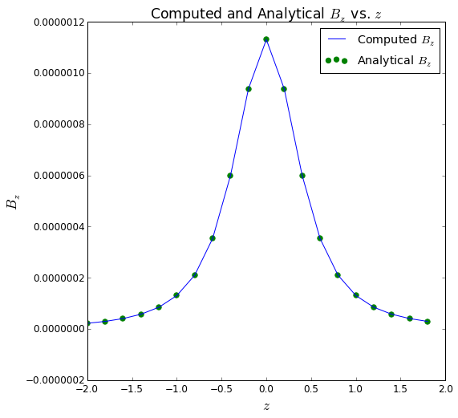
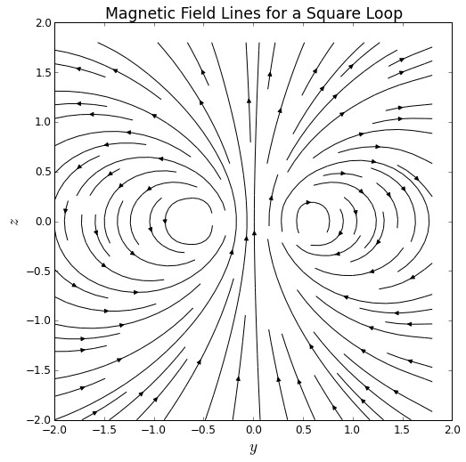
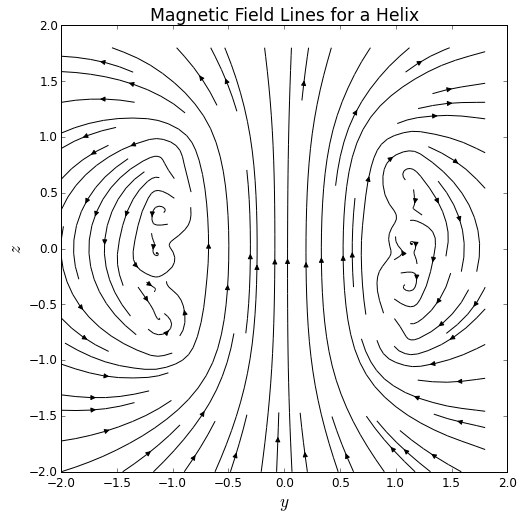

# Calculating the magnetic field with the Biot-Savart Law

Developed by J. D. McDonnell

In this set of exercises, the student will implement code for the Biot-Savart law to compute the magnetic field at any point in space due to a square-shaped loop.  

Upon calculating the magnetic field at many points in space, the student will prepare a vector plot of the magnetic field.

	
Course Context
: Beyond the First Year Electricity & Magnetism
	
	
Learning Objectives
: Students who complete these exercises will

 - be able to describe in pseudo-code how to calculate the magnetic field around a wire loop with the Biot-Savart law (**Exercises 1 and 2**);
 - be able to use numerical integration to calculate the magnetic field with the Biot-Savart law (**Exercises 1, 2 and 3**);
 - be able to compare the numerical solution to the analytical solution for special cases (**Exercises 1 and 2**);
 - be able to describe and assess the magnetic field lines that result from their calculation (**Exercise 3**);
 - and be able to generalize their code to calculate the magnetic field for a wire of *any* shape (**Extension**).
	

## Instructor's Guide
In this set of exercises, the student will implement code for the Biot-Savart law to compute the magnetic field at any point in space due to a square-shaped loop.  In an extension, the student will generalize their code to calculate the magnetic field for *any* loop shape.  

In the first exercise, the student will calculate the magnetic field at the center of a square loop both analytically and numerically.  This exercise will give the student confidence in the validity of the numerical approach.  

For a square loop of current-carrying wire, the magnetic field component $B_z$ can be computed exactly along the entire $z$-axis.  A good continuation for Exercise 1 is to have the student perform this additional calculation both numerically and analytically.  The comparison can be made in a plot of $B_z$ vs. $z$.

In the second exercise, the student will extend their numerical approach to calculate the magnetic field due to the square loop at *any* point in space.  This does not have a closed-form analytic solution - it is worthwhile to allow the students to try and see the point where they encounter very hard integrals.  In the absence of a closed-form analytic solution, the student must think carefully how to validate the numerical calculation with his or her knowledge of physics.  

Finally, in the Extension the student is "turned loose" to invent his or her own wire geometry.  The student is challenged to generalize the approach developed in the previous Exercises, while allowed the opportunity to be creative and tackle additional situations that they find interesting.  

### Comments, Tips, and Suggestions

#### Plotting Vector Fields

In Exercise 2 and the Extension, the student will numerically compute the magnetic field $\vec{B}(\vec{r})$ for many values of the point $\vec{r}$ in the $yz$-plane.

Many software packages for graphing provide the ability to plot either Arrows or Streamlines for vector fields.  

 - In Python, the ``matplotlib`` library provides the ``quiver`` function for Arrows and the ``streamplot`` function for Streamlines.  
 - In Mathematica, the ``VectorPlot`` function plots Arrows, and the ``StreamPlot`` function plots Streamlines.  
 - In Gnuplot, only Arrows may be plotted, by adding the ``with vectors`` attribute to the ``plot`` command.  

Because the magnitude of the magnetic field in these exercises is typically small, the magnetic field vectors might need to be manually scaled when making Arrow plots.  

It is also natural to extend these exercises beyond the $yz$-plane, so that the student calculates the magnetic field in 3D space.  The packages listed above do have the capability of plotting vector fields in 3D, as well (except for the ``matplotlib`` ``streamplot`` function, at the time of writing).  

#### Numerical integration

This exercise set requires some method for numerical integration.  Many programming environments provide functions for numerical integration:

 - In Python, the Scipy library has the ``scipy.integrate.quad`` function.
 - Mathematica has the built-in ``NIntegrate`` function.  
 - Programming languages such as Fortran and C can call integration subroutines found in, for example, the QUADPACK library, found at http://www.netlib.org.  

If the instructor wishes, the students can also write their own numerical integration functions.  

Because the Biot-Savart law includes a division by the magnitude of $\vec{r} - \vec{r}\ ' $, division by zero (or very small numbers) can be encountered when $\vec{r} \approx \vec{r}\ ' $.  Division by zero can be avoided by either (1) placing the wire so that no part of the wire lands on a $\vec{r}$ grid point, or (2) modifying the user-defined function for the integrand so that it simply returns $0$ if $\left\vert \vec{r} - \vec{r}\ ' \right\vert < \epsilon$, for some small number $\epsilon$.   

#### Handling the Wire Geometry

One challenging aspect of using the Biot-Savart law to calculate the magnetic field, whether analytically or numerically, is how to handle the geometry of the wire.  The case of the square wire treated in these exercises is straightforward in the analytical calculation.  

Handling the geometry of the square wire numerically, however, is not trivial.  On the other hand, it is not beyond the grasp of an intermediate-level undergraduate student, and serves as a very good exercise in and of itself.  

If the instructor wishes to assign this task as an exercise to the student, some guiding principles are provided below.  If the instructor does not wish to concentrate on this topic, functions which perform this task are given in this Exercise Set's Code Template and may be provided to the student.  

The essential concept in writing the functions for $\vec{r}\ ' (t)$ and $\mathrm{d}\vec{\ell}\ ' (t)$ is the use of *linear interpolation* between the vertices of the square.  For two of the square's vertices, $\vec{v}_1$ and $\vec{v}_2$, any point between these two vertices can be found by

$$ \vec{r}\ ' (t) = \vec{v}_1 + \frac{t-t_1}{t_2 - t_1}\left( \vec{v}_2 - \vec{v}_1 \right), $$

where $t_1$ and $t_2$ are the values of $t$ such that $\vec{r}\ ' (t_1) = \vec{v}_1$ and $\vec{r}\ ' (t_2) = \vec{v}_2$.  

The tangent to the wire, $\mathrm{d}\vec{\ell}\ ' (t)$, is found by taking the derivative of the above expression with respect to $t$:

$$ \frac{\mathrm{d}\vec{\ell}\ ' }{dt} = \frac{1}{t_2 - t_1}\left( \vec{v}_2 - \vec{v}_1 \right) .$$

This interpolation technique may then be used for any wire shape that can be described well by a sequence of straight lines, such as any polygon.  

For the Extension, the student is encouraged to construct his or her own wire geometry.  Certain shapes, such as the suggested circle or helix, and be constructed with analytic expressions for $\vec{r}\ ' $ and $\mathrm{d}\vec{\ell}\ ' $.  If the student is comfortable with interpolation techniques, such as *interpolating splines*, the student will be able to construct wires with very interesting arbitrary curves.

## Theory
According to the Biot-Savart law, the magnetic field at a point in space $\vec{r}$ due to steady current $I$ running through an arbitarily shaped wire is given by

$$ \vec{B}\left(\vec{r}\right) = \frac{\mu_0 I}{4\pi}\int\left. \frac{\mathrm{d}\vec{\ell}\ ' \times\left(\vec{r}-\vec{r}\ ' \right)}{\left\vert \vec{r} - \vec{r}\ ' \right\vert^{3}}\right. , $$

where the integration "scans" over "bits" of the wire, each in turn located at $\vec{r}\ ' $.  

Because the wire is a one-dimensional curve, it can be parametrized by a single parameter $t$. The location of each "bit" of the wire is then described by the parametric functions

$$ \vec{r}\ ' = \left\lbrack\begin{array}{c} x(t) \\ y(t) \\ z(t) \end{array} \right\rbrack . $$

The tangent to a given point on the curve can then be found via

$$ \mathrm{d}\vec{\ell}\ ' = \left\lbrack\begin{array}{c} dx(t)/dt \\ dy(t)/dt \\ dz(t)/dt \end{array} \right\rbrack \mathrm{d}t. $$

It is also convenient to choose the parameter $t$ in such a way that $t=0$ corresponds to the beginning of the curve, and $t=1$ corresponds to the end of the curve - or, for a closed curve, to the point where the curve has wrapped around to the beginning again.  

As such, the integral can be recast

$$ \vec{B}\left(\vec{r}\right) = \frac{\mu_0 I}{4\pi}\int_0^1\left. \frac{\frac{\mathrm{d}\vec{\ell}\ ' }{dt}\times\left(\vec{r}-\vec{r}\ ' \right)}{\left\vert \vec{r} - \vec{r}\ ' \right\vert^{3}}\right. \mathrm{d}t . $$

For "simple" wire geometries and spatial positions, this integral can be evaluated analytically.  For more realistic wire geometries and general spatial positions, this integral becomes difficult and warrants a numerical treatment.

## Pseudocode
Import packages.

Define constants - $\mu_0$, $I$...

Define a function for the "bits" of wire, $\vec{r}\ ' (t)$:

  - For the segment of straight wire, use linear interpolation between the two ends of the wire.
  - For the square loop, use linear interpolation between the four vertices of the square.

Define a function for the tangent to the wire, $\frac{\mathrm{d}\vec{\ell}\ ' }{dt}$.

Define functions for the $x$, $y$, and $z$ components of the Biot-Savart integrand for each value of parameter $t$ and spatial position $\vec{r}$:

  - Calculate $\vec{r}\ ' (t)$.
  - Calculate $\mathrm{d}\vec{\ell}\ ' /dt$ for parameter $t$.
  - Calculate the cross product $\frac{\mathrm{d}\vec{\ell}\ ' }{dt} \times \left( \vec{r}- \vec{r}\ ' \right)$.
  - Divide that result by the denominator, $\left\vert \vec{r}- \vec{r}\ ' \right\vert^3$.
  - Multiply the result by $\frac{\mu_0}{4\pi}$ and return.

Define the grid of spatial positions $\vec{r}$.

For each point in the spatial grid $\vec{r}$:
  - Integrate the Biot-Savart integrand defined above from $t=0$ to $t=1$, storing the $x$, $y$, and $z$ components of the result in $\vec{B}(\vec{r})$.

Record or plot the resulting magnetic field, $\vec{B}(\vec{r})$.

## Code Templates

 * code/IPython/CodeTemplate/Inline1.txt provided by Jordan McDonnell

## Completed Code

 * code/Fortran/CompletedCode/Inline1.txt provided by Jordan McDonnell
 * code/IPython/CompletedCode/Inline2.txt provided by Jordan McDonnell

## Solutions
According to the Biot-Savart law,
$$ \vec{B}(\vec{r})=\frac{\mu_{0}I}{4\pi}\int\frac{\mathrm{d}\vec{\ell}\ ' \times\left(\vec{r}-\vec{r}\ ' \right)}{\left\vert \vec{r}-\vec{r}\ ' \right\vert ^{3}}.$$

For a curve parameterized as
$$ \vec{r}\ ' = \left\lbrack x(t), y(t), z(t)\right\rbrack , $$
we can express the differential element as
$$ \mathrm{d}\vec{\ell}\ ' = \left\lbrack \frac{\mathrm{d}x}{\mathrm{d}t}, \frac{\mathrm{d}y}{\mathrm{d}t}, \frac{\mathrm{d}z}{\mathrm{d}t} \right\rbrack \mathrm{d}t. $$

It is convenient to let this parameter $t$ run from $0$ (at the beginning point of the curve) to $1$ (at the ending point of the curve).

### Exercise 1

Analytically, the magnetic field a distance $a$ away from the midpoint of a current-carrying wire segment of length $L$ is

$$ \left\vert \vec{B} \right\vert = \frac{\mu_0 I}{4\pi a}\frac{L}{\sqrt{a^2 + (L/2)^2}}, $$

pointing in the direction dictated by the right-hand rule.  In this Exercise, the length $L = 1.0$m, and the distance $a=0.5$m.  As such, the magnitude of the magnetic field is $\left\vert\vec{B}\right\vert = 2.83\times 10^{-7}$ T, pointing in the positive $z$-direction.  

For the numerical implementation, the essential concept in writing the functions for $\vec{r}\ ' (t)$ and $\mathrm{d}\vec{\ell}\ ' (t)$ is the use of *linear interpolation* between the two ends of the wire segment.  For the two ends of the wire segment, $\vec{v}_1$ and $\vec{v}_2$, any point between these two ends can be found by

$$ \vec{r}\ ' (t) = \vec{v}_1 + \frac{t-t_1}{t_2 - t_1}\left( \vec{v}_2 - \vec{v}_1 \right), $$

where $t_1=0$ and $t_2=1$.  

The tangent to the wire, $\mathrm{d}\vec{\ell}\ ' (t)$, is found by taking the derivative of the above expression with respect to $t$:

$$ \frac{\mathrm{d}\vec{\ell}\ ' }{dt} = \frac{1}{t_2 - t_1}\left( \vec{v}_2 - \vec{v}_1 \right) .$$

### Exercise 2

For a square loop of wire with side length $a$, the magnetic field strength at the center is exactly

$$ B_z = \frac{2\sqrt{2} \mu_0 I}{\pi a}. $$

Computed $B_z$:   $1.13\times 10^{-6}$ T

Analytical $B_z$:  $1.13\times 10^{-6}$ T

Percent Error: $-1.87\times 10^{-14} \%$

We see that there is excellent agreement between the numerical value of $\vec{B}$ at the origin, and the analytically expected value of $\vec{B}$.

Because the magnetic field component $B_z$ can be computed exactly along the $z$-axis, the comparison between the analytical $B_z$ and the numerically computed $B_z$ is plotted below.

The exact $B_z$ along the $z$-axis for a square loop with side length $a$ is
$$ B_z(z) = \frac{\mu_0 I a^2}{2\pi \left( z^2 + \frac{a^2}{4} \right) \sqrt{z^2 + \frac{a^2}{2}}}. $$

We see excellent agreement between the numerically computed $B_z$ and the analytical $B_z$ on the $z$-axis.

### Exercise 3

As we expect for a loop of wire, we see a magnetic field pattern that resembles that of a dipole field outside of the loop.  Inside the loop, we see that the magnetic field is, indeed, strongest at points near the wire itself.  This exercise can be used to emphasize the relationship between the density of magnetic field lines and the strength of the magnetic field - the field lines are densest where the magnetic field is strongest (at points near to the source), and the field lines are sparser where the magnetic field is weaker (at points farther away from the source).

### Extension

As an example of another wire geometry, a helical wire of radius $R$, height $L$, and $N$ turns is parameterized by
$$ x(t) = R \cos\left( 2\pi N\,t \right), $$
$$ y(t) = R \sin\left( 2\pi N\,t \right), $$
$$ z(t) = Lt - \frac{1}{2}L. $$

In the example below, $R=1$, $N=80$, and $L=2.0$.

Because this helix is a simple approximation of a solenoid, we do see the magnetic field become nearly uniform inside the helix.  From the density of the field lines, the magnetic field is also seen to be much stronger inside the helix than outside.  Outside of the helix, we see the magnetic field begin to resemble the magnetic field of a dipole, as it should.

## Connections to Physics Texts
D. J. Griffiths, *Introduction to Electrodynamics*, Chapter 5.

